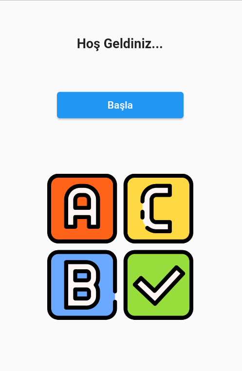
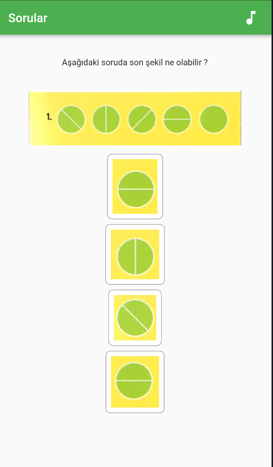
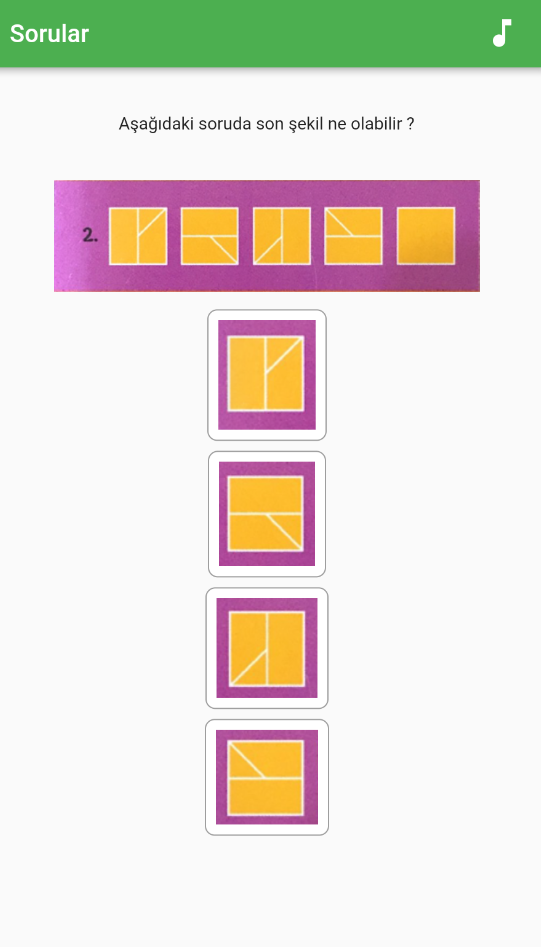
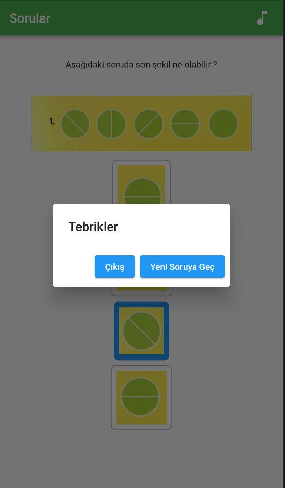
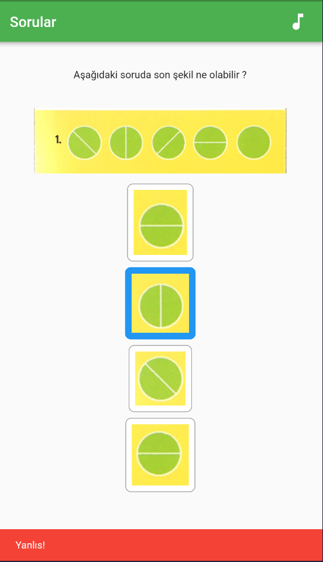

# Proje Adı ve Tanıtımı

 Şekil Sırası Bulma Kart Oyunu. Bu proje Fırat Üniversitesi Yazılım Mühendisliği Güncel Konular dersinin vize proje ödevi için verilen çocuk oyun kartlarından "Şekil Sırası" kartının mobil uygulama olarak yapılmış halidir.

# İçindekiler

- [Proje Adı ve Tanıtımı](#proje-adı-ve-tanıtımı)
- [Proje Hakkında](#proje-hakkında)
  - [Proje Özellikleri](#proje-özellikleri)
- [Proje Resimleri - Proje Videosu - Apk Dosyası](#proje-resimleri---proje-videosu---apk-dosyası)
  - [Resimler](#resimler)
  - [Video](#video)
  - [Apk Dosyası](#apk-dosyası)
- [Projeyi Kullanmak için Ön Gereksinimler](#projeyi-kullanmak-için-ön-gereksinimler)
- [Proje Kurulum](#proje-kurulum)
- [Diğer Dökümanlar](#diğer-dökümanlar)

# Proje Hakkında

Bu uygulama Yazılım Mühendisliği Güncel Konular dersi kapsamında verilen bir proje ödevi için yapılmıştır. Uygulama çocukların algoritmik zekalarına ve düşüncme becerilerinin gelişmesine katkı sağlamak amacıyla yapılmıştır. Uygulamada şekillerden oluşmuş diziler gelmektedir ve bu dizilerin son şeklinin hangi şekil olacağı sorulmaktadır böylelikle çocukların düşünme ve algoritmik becerilerine katkı sağlanması amaçlanmıştır. Aynı zamanda arka planda çalan piyano melodisi çocukları rahatlatmayı amaçlamıştır. Uyguluma geliştirilmeye açıktır.

### Proje Özellikleri
- Alogritmik zeka ve düşünme beceri geliştirici matematik soruları
- Piyano müziği eşliğinde odaklanma
- Çocuklar için uygun
- Çoktan seçmeli sorular ve şıklı cevplar
- Uygulama müziği açma kapama

# Proje Resimleri - Proje Videosu - Apk Dosyası
### Resimler
      
### Video
<a href="https://drive.google.com/file/d/1jCx0t9dCJjchHgFj9k3RK098ZtEcMFXJ/view?usp=sharing" target="_blank" onclick="window.open('https://drive.google.com/file/d/1jCx0t9dCJjchHgFj9k3RK098ZtEcMFXJ/view?usp=sharing'); return false;">Video için tıklayın</a> 
### Apk Dosyası
Dilerseniz aşağıda bulunan kurulum işlemlerini yapmadan bu apk dosyasını indirerek telefonunuzda çalıştırıp uygulamayı kullanabilirsiniz.
<a href="https://drive.google.com/file/d/1NDRuzJbyWB8QCWIm2M2f8gjLi32mZ2Zr/view?usp=sharing" target="_blank" onclick="window.open('https://drive.google.com/file/d/1NDRuzJbyWB8QCWIm2M2f8gjLi32mZ2Zr/view?usp=sharing'); return false;">   ㅤ
  Apk dosyasını indirmek için tıklayın</a>

# Projeyi Kullanmak için Ön Gereksinimler

- Flutter SDK'nın yüklü olması gerekmektedir. Yükleme talimatları için [Flutter web sitesini](https://flutter.dev) ziyaret edebilirsiniz.
- Dart SDK'nın yüklü olması gerekmektedir.
- Android Studio veya Visual Studio Code gibi bir IDE gerekmektedir.
- Emülatör veya fiziksel bir cihazda çalıştırmak için Android veya iOS simülatörüne ihtiyaç vardır.

# Proje Kurulum
1.Adım- Flutter SDK'yı bilgisayarınıza indirin ve yükleyin. Flutter'ı resmi web sitesinden indirebilirsiniz: https://flutter.dev.

2.Adım- Flutter SDK'yı bilgisayarınıza kurduktan sonra, bir terminal açın ve aşağıdaki komutu çalıştırın:

`flutter doctor`

Bu komut, Flutter'ın kurulumunu doğrular ve gerekli bağımlılıkların doğru şekilde yüklendiğinden emin olur.

3.Adım- Proje deposunu yerel makinenize klonlayın. Bunun için terminalde aşağıdaki komutu kullanabilirsiniz:

`git clone https://github.com/gzcmustafa/flutter_project_forYmgk`

kullaniciadi yerine GitHub kullanıcı adınızı, lesson_ymgk_project ise repo adınızı belirtmelisiniz.

4.Adım- Terminalde proje dizinine gidin:

`cd flutter_project_forYmgk`

5.Adım- Proje bağımlılıklarını yüklemek için aşağıdaki komutu çalıştırın:

`flutter pub get`

Bu komut, projenin pubspec.yaml dosyasındaki bağımlılıkları otomatik olarak indirecektir.

6.Adım- Uygulamayı çalıştırmak için aşağıdaki komutu kullanabilirsiniz:

`flutter run`

Bu komut, Flutter SDK'nın yerel emülatörde veya bağlı bir cihazda uygulamayı çalıştırmasını sağlar.

# Diğer Dökümanlar
<a href="https://github.com/gzcmustafa/flutter_project_forYmgk/tree/main/other_Documents" target="_blank">Tıklayınız</a>

